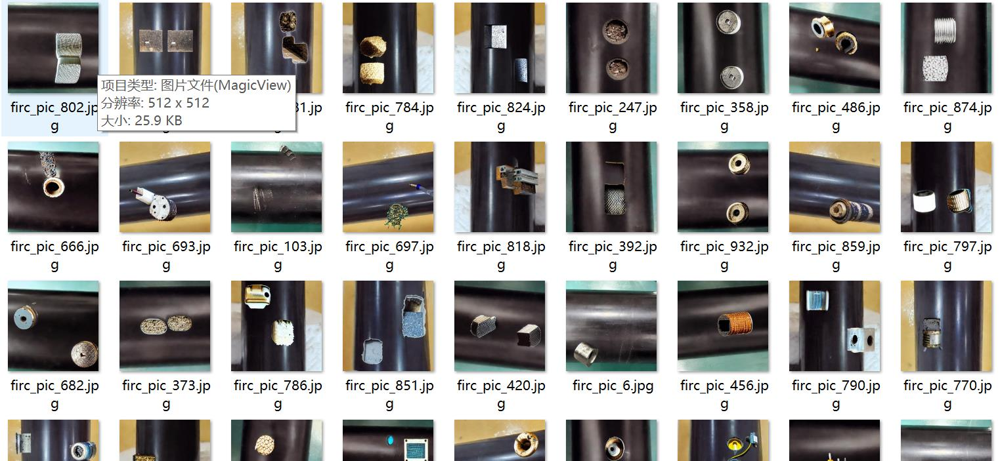
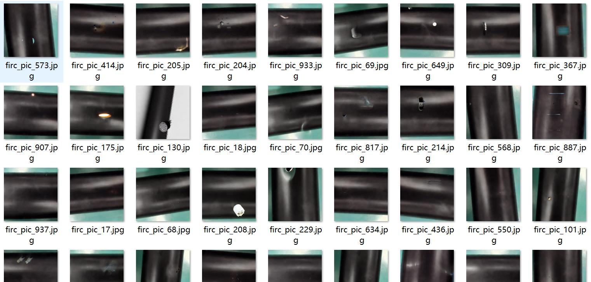
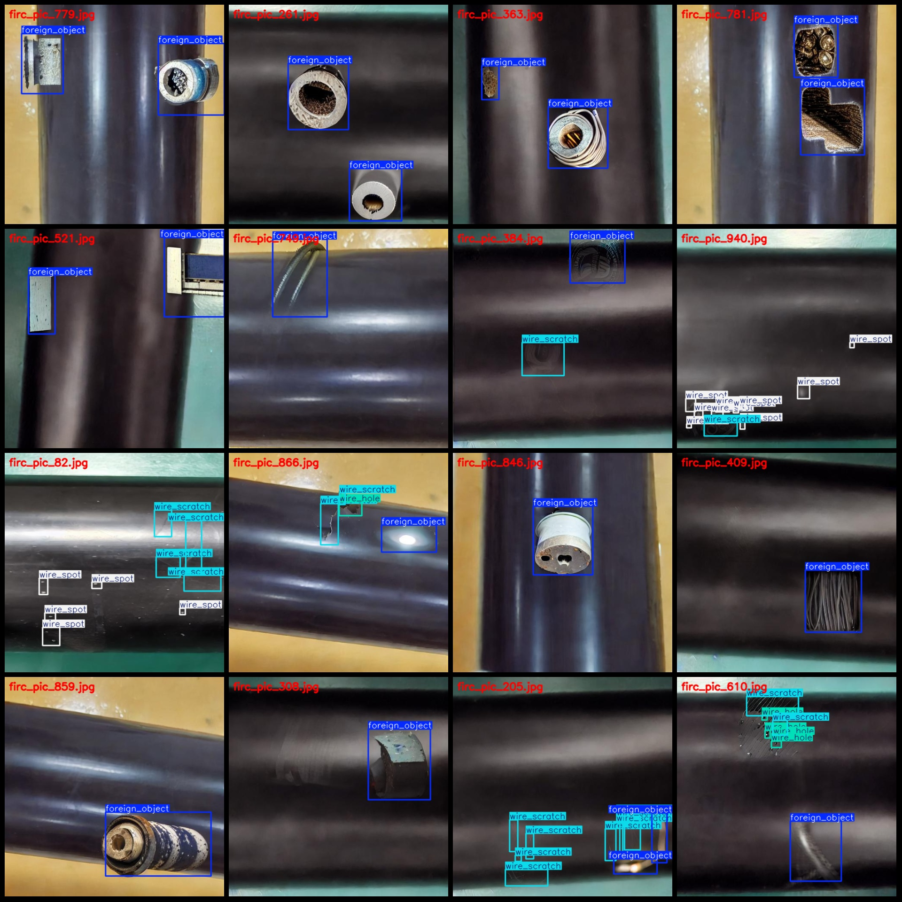
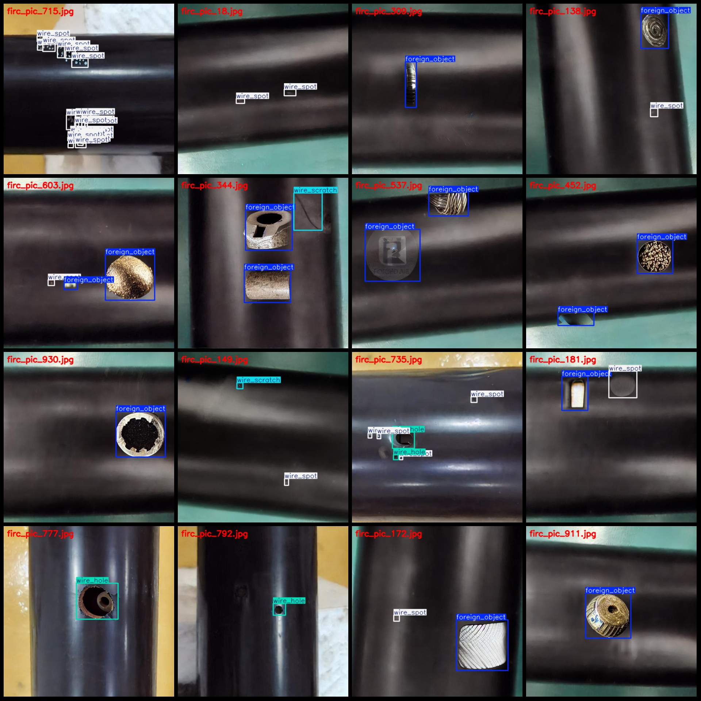

# Cable Black Wire Defect Identification with Spots, Scratches, Holes, and Foreign Objects Dataset in VOC+YOLO format - 975 Instances for 4 Classes

**Note: Dataset is for image synthesis, specifics to be seen in image.**

The dataset format is Pascal VOC format+YOLO format (without split path in the txtfile, only containing jpgimage and corresponding VOC format xmlfile and yolo format txtfile).

Image count (jpg files): 975
Annotation count (xml files): 975
Annotation count (txt files): 975
Number of annotations: 4
Annotation category names (based on classes.txt in the labels folder, note that the order of yolo categories may differ from here): ["foreign_object", "wire_hole", "wire_scratch", "wire_spot"]

The total number of boxes in each category:
- Foreign Object boxes = 897
- Wires Hole boxes = 289
- Wires Scratch boxes = 588
- Wires Spot boxes = 669
Total boxes: 2443

images per class: 
- Foreign object images = 673
- Wired hole images = 219
- Wired scratch images = 291
- Wired spot images = 302

The image resolution is 512x512.

Use the labelImg tool

Annotation rule: Draw a rectangle around the class.

Important note: The dataset does not have a split into training, validation, and test sets.

Special Notice: This dataset does not guarantee the accuracy of the trained model or weight files.

Image preview:
## Images

Here is a pay link on Stripe ( https://buy.stripe.com/3cs8yP7sY87d0vu9AB ). Please contact me lonlonago@foxmail.com after funding $89, and I will send you a complete data files , thank you!

